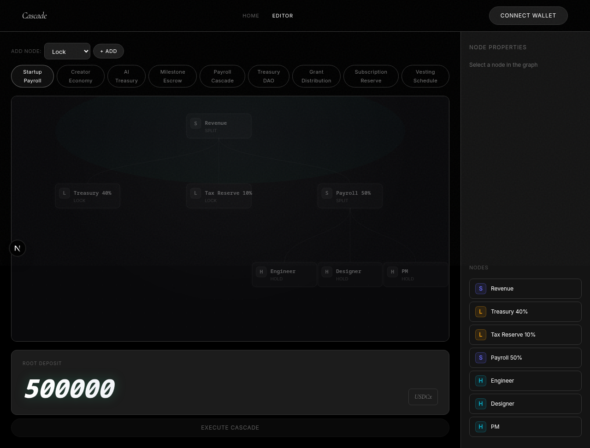

# Cascade

**Recursive Money Flow Graphs on FlowVault · Built for Stacks**

One deposit. A directed acyclic graph of FlowVault vaults executes. The keeper automaton chains Lock, Split, and Hold at every downstream node until the entire cascade settles. No manual transfers. No spreadsheets. Just code.

[](https://stacks.co)
[](https://github.com/yashpunmiya/Flowvault)
[](./contracts/cascade-registry.clar)

---

## What It Does

Define a graph where each node is a FlowVault routing rule. Nodes connect with edges representing fund flow. Deposit USDCx once at the root — the keeper watches the Stacks blockchain and automatically cascades funds through every downstream node in topological order.

```
    [Company Deposit]  ← root: one deposit
       /        \
   [Lock]      [Split]
  90d/60%    Salary/35%
                /    \
          [Hold]    [Hold]
         Dev Lead  Frontend
```

## Architecture

```
┌─────────────────────────────────────────┐
│  Cascade Registry (Clarity)            │
│  On-chain graph storage & discovery    │
├─────────────────────────────────────────┤
│  Graph Engine (TypeScript)             │
│  DAG validation, topological sort      │
├─────────────────────────────────────────┤
│  Cascade Keeper (TypeScript)           │
│  Multi-node FlowVault SDK orchestrator │
├─────────────────────────────────────────┤
│  FlowVault Contracts (Stacks testnet)  │
│  Lock · Split · Hold primitives        │
└─────────────────────────────────────────┘
```

## Why Cascade Is Different

Most FlowVault apps use a single primitive: `Deposit → Lock`. Cascade chains all three.

```
Traditional FlowVault:          Cascade:

  Deposit → Lock                  Deposit
                                   ├─ Lock
                                   ├─ Split
                                   ├─ Hold
                                   └─ More Cascades
```

Cascade transforms FlowVault primitives into recursive programmable money systems, enabling organizations to compose entirely new financial behaviors from reusable routing graphs.

## Templates (6)

| Template | Nodes | Structure |
|---|---|---|
| Startup Payroll | 7 | Revenue → Treasury lock 40% + Tax reserve 10% + Payroll split 50% → Eng / Designer / PM |
| Creator Economy | 7 | Revenue → Creator 70% + Editor 15% + Community 10% + Reserve lock 5% → Music / Art |
| AI Treasury | 6 | Revenue → Agent Ops split 40% + Compute lock 35% + Safety lock → Profit + Infra |
| Milestone Escrow | 4 | Client deposit lock 100% → Milestone 1 / Milestone 2 → Final payout |
| Payroll Cascade | 5 | Company deposit → 90-Day runway lock 60% + Salary split → Dev Lead / Frontend |
| Treasury DAO | 5 | DAO Treasury → Core Reserve lock 50% + Ops split → Contributors / Emergency Fund |

All templates are valid DAGs — single root, no cycles, topologically sorted — and load directly in the editor.

## Live Demo

**[cascade-rust.vercel.app](https://cascade-rust.vercel.app)** — Landing page with scroll-reveal cascade animation, "Why Cascade Is Different" comparison, and template gallery.

**[cascade-rust.vercel.app/editor](https://cascade-rust.vercel.app/editor)** — Full graph builder with 10 pre-built templates, node property editor, FlowVault wallet integration, and cascade execution.

### Landing Page


### Graph Editor



The editor shows a DAG canvas with selectable nodes, a properties panel, and the "Execute Cascade" button that chains FlowVault contract calls on Stacks testnet. Connect a Leather or Xverse wallet, select a template, customize percentages, set recipient addresses, and execute.

## Smart Contract

`contracts/cascade-registry.clar` stores published cascade graph definitions on-chain:
- `register-graph` — publish a graph (name, description, node/edge count)
- `get-graph` — retrieve graph metadata by ID
- `get-graphs-by-creator` — count graphs published by a creator
- `get-graph-by-creator-index` — fetch a creator's graph by index
- `delete-graph` — creator-only deletion

**Testnet contract**: `ST3EH039PNE6HSXYV1CY0AC58SA0N06GMHS3CQB9H.cascade-registry-v2`

## On-Chain Proofs

All transactions confirmed on Stacks testnet — verifiable via Hiro Explorer.

| Transaction | Function | Result | Explorer |
|---|---|---|---|
| Contract Deploy | `cascade-registry-v2` | Success | [`0x294a...`](https://explorer.hiro.so/txid/0x294a7f27abcdac1dbcf5d482e04566f1eae70e1d5ce64f07ea0ef8b3c4dceb13?chain=testnet) |
| Register Graph | `register-graph` | Success | [`0xcd03...`](https://explorer.hiro.so/txid/0xcd03fb8c98218b7ef24d6d8fef19fa7ec905357bce1aff38753638eb92f35adf?chain=testnet) |
| Clear Routing | `clear-routing-rules` | `(ok true)` | [`0x4ddf...`](https://explorer.hiro.so/txid/0x4ddf2692f388cfeb24facb0586cb5fa800e024116abc2d0d0ccf33e58fbfcac5?chain=testnet) |
| Set Routing Rules | `set-routing-rules` (Lock 2.5 USDCx) | `(ok true)` | [`0x438a...`](https://explorer.hiro.so/txid/0x438ad09ed49a57a687090eca2527f93787cdd940982f38f1cfb2fbf3061fb474?chain=testnet) |
| FlowVault Deposit | `deposit` (5 USDCx) | 5 deposited, 2.5 locked, 2.5 held | [`0x4edb...`](https://explorer.hiro.so/txid/0x4edab35dcad547bd7511f4b77ccd018ba3c1bb0d685d6576c322f4e240274b15?chain=testnet) |

FlowVault deposit result: `(ok (tuple (deposited u5000000) (held u5000000) (locked u2500000) (split u0)))`

### Recent Testnet Transactions (CLI Wallet)

Wallet: `ST1H099KW6K2M17JVAC8C5TFBT4HDRC8DHYKZNJGX` (500 STX via [faucet](https://explorer.hiro.so/txid/0x99a148839fdb50933526c463ced88810effbe93b00416ef88107152a304d93d6?chain=testnet))

| # | Function | Tx ID |
|---|---|---|
| 1 | `clear-routing-rules` | [`0xc389c2...`](https://explorer.hiro.so/txid/0xc389c276e3e66556d4160b0edf309c5c7ad4828712aedf31eb5ea078f202fe23?chain=testnet) |
| 2 | `set-routing-rules` (Lock 0.5 USDCx, Hold 0.5) | [`0x233605...`](https://explorer.hiro.so/txid/0x233605d3f9a55725789969d9936c79b27e0247b7e07f844aad7557b940a9dd6e?chain=testnet) |

> **Note**: The `deposit` step requires USDCx tokens. Testnet USDCx is bridged via Circle's CCTP protocol (`usdcx-v1` contract). Execute `npx tsx scripts/execute-cascade.ts` after bridging USDCx from Circle Devnet.

## Quick Start

```bash
npm install
npm run dev
```

Open `http://localhost:3000` — the cinematic landing page with step-by-step scroll reveal.

Open `http://localhost:3000/editor` — the full cascade builder with graph canvas, node property editor, and FlowVault wallet integration.

## Project Structure

```
├── contracts/           # Clarity smart contracts
│   └── cascade-registry.clar
├── app/
│   ├── page.tsx         # Landing page (/)
│   ├── editor/page.tsx  # Cascade editor (/editor)
│   └── globals.css
├── components/
│   ├── CascadeApp.tsx   # Landing page orchestration
│   ├── EditorPage.tsx   # Graph editor + execute
│   ├── GraphSVG.tsx     # Shared DAG visualization
│   └── Preloader.tsx    # Typewriter preloader
├── lib/
│   ├── graph-engine.ts  # DAG types, validation, topological sort
│   ├── cascade-flow.ts  # Multi-node keeper orchestrator
│   ├── config.ts        # FlowVault contract principals
│   ├── flowvault.ts     # FlowVault SDK initialization
│   └── goals.ts         # Use case definitions
├── hooks/
│   ├── useGraphCascade.ts   # Cascade execution hook
│   ├── useStacksWallet.tsx  # Stacks wallet connection
│   └── usePropertyEscrow.ts # FlowVault deposit hook
└── tests/
    └── cascade-registry.test.ts
```

## FlowVault Integration

Cascade uses the FlowVault SDK to interact with deployed testnet contracts:

| Primitive | How Cascade Uses It |
|-----------|-------------------|
| **Lock** | Time-locks portions of cascading funds at each node |
| **Split** | Routes funds to recipients (salary, penalty, treasury) |
| **Hold** | Keeps remaining balance liquid for downstream nodes |

Contract addresses:
- FlowVault v2: `STD7QG84VQQ0C35SZM2EYTHZV4M8FQ0R7YNSQWPD.flowvault-v2`
- USDCx testnet: `ST1PQHQKV0RJXZFY1DGX8MNSNYVE3VGZJSRTPGZGM.usdcx`

## How It Works — Templates, Mock Data, and Real Transactions

### Templates are Starting Points, Not Mock Data

The 10 graph templates in `lib/graph-engine.ts` are **pre-built graph configurations** — they define node labels, types (Lock/Split/Hold), percentages, and edge connections. These are loaded into the editor as a starting point. You customize them (change percentages, add/remove nodes, connect edges, set recipient addresses) before executing.

**What's pre-configured (editable in the UI):**
- Node positions and types
- Default lock percentages (e.g., "60%")
- Default lock duration in Stacks blocks
- Graph topology (edges between nodes)

**What's NOT mocked — requires a connected wallet:**
- All FlowVault SDK calls (`setRoutingRules`, `deposit`, `clearRoutingRules`)
- Stacks blockchain transactions (confirmed onchain)
- USDCx token transfers (real SIP-010 fungible token on testnet)
- Contract interactions with `flowvault-v2` and `usdcx` testnet contracts

### Execution Flow (When Connected)

```
1. User clicks "Execute Cascade" 
2. Graph is validated (DAG: single root, no cycles)
3. For each node in topological order:
   a. clearRoutingRules() — resets FlowVault routing config
   b. setRoutingRules({ lockAmount, lockUntilBlock, splitAddress, splitAmount }) — on-chain tx
   c. deposit(amount) — transfers USDCx into the FlowVault
   d. waitForTransactionSuccess(txId) — polls Hiro API until confirmed
   e. Hold balance cascades to child nodes as their deposit amount
4. All transaction links shown with Hiro Explorer URLs
```

### Stacks Testnet Wallet for Development

A generated testnet wallet for local testing:

| Field | Value |
|---|---|
| Address | `ST1H099KW6K2M17JVAC8C5TFBT4HDRC8DHYKZNJGX` |
| Network | Stacks Testnet |
| STX Balance | 500 (funded via faucet) |
| Tx | [`0x99a148...`](https://explorer.hiro.so/txid/0x99a148839fdb50933526c463ced88810effbe93b00416ef88107152a304d93d6?chain=testnet) |

> **Note**: The frontend uses browser wallet extension (Leather/Xverse) which generates SP3-prefix single-sig addresses. The CLI-generated ST1 address uses a multi-sig format that the Hiro faucet accepts. Both are valid testnet accounts.

### Required Tokens

The Cascade app uses **USDCx** (testnet), a SIP-010 token:
- Contract: `ST1PQHQKV0RJXZFY1DGX8MNSNYVE3VGZJSRTPGZGM.usdcx`
- FlowVault: `STD7QG84VQQ0C35SZM2EYTHZV4M8FQ0R7YNSQWPD.flowvault-v2`

To execute cascades, your wallet needs **both STX (for gas) and USDCx (for deposits)**.

## Tech Stack

- **Frontend**: Next.js 16, React 19, TypeScript
- **Styling**: Pure CSS with cinematic scroll animations
- **Blockchain**: Stacks testnet, Clarity, FlowVault SDK
- **Wallet**: @stacks/connect (Leather, Xverse)
- **Testing**: Vitest, Clarinet

## License

MIT
